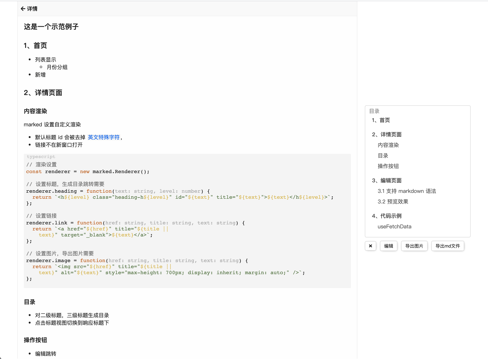
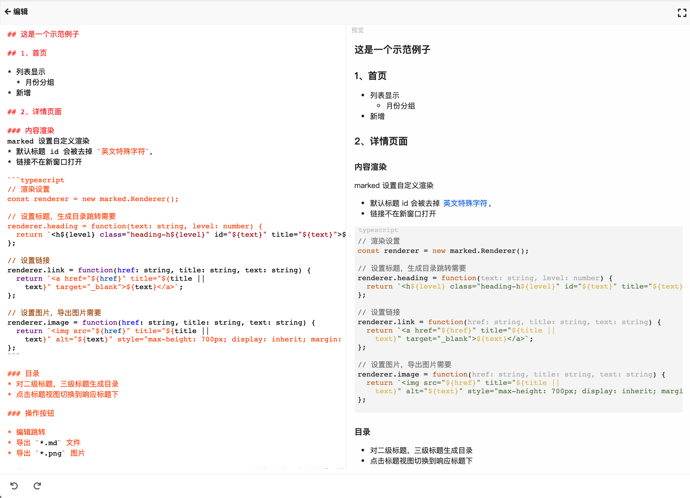
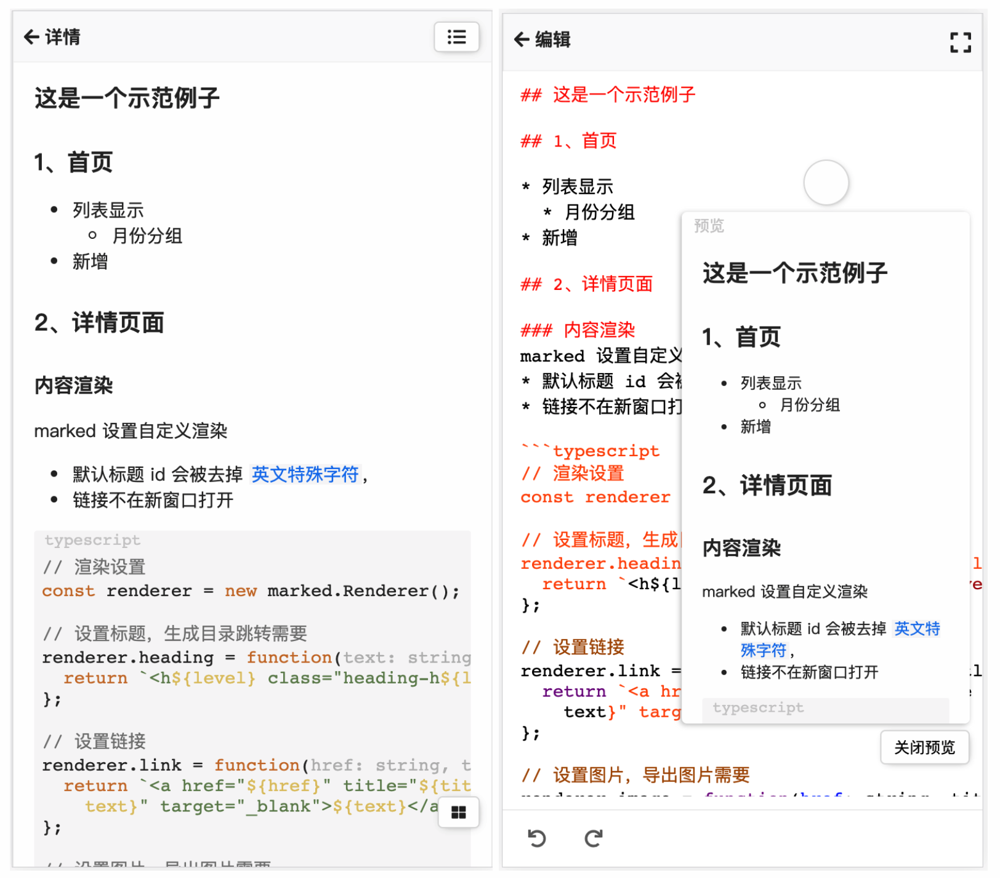

# md-note 说明

## 前言
大概说一下：
* React+Hook+TypeScript
* scss+css-module
* markdown 渲染使用 [marked.js](https://marked.js.org)，语法高亮使用 [highlight.js](https://highlightjs.org/) 
* 图片导出使用 [html2canvas](http://html2canvas.hertzen.com/)，纯前端操作（导出markdown同）
* 编辑器使用 [codemirror.js](https://codemirror.net/)

> **！注意：**<br>
> 不提供数据存储服务，仅使用浏览器缓存


## 1、首页

* 列表显示
  * 月份分组
* 新增


## 2、详情页面

### 内容渲染
`marked` 设置自定义渲染
* 默认标题 id 会被去掉 `英文特殊字符`，
* 链接不在新窗口打开

```typescript
// 渲染设置
const renderer = new marked.Renderer();

// 设置标题，生成目录跳转需要
renderer.heading = function(text: string, level: number) {
  return `<h${level} class="heading-h${level}" id="${text}" title="${text}">${text}</h${level}>`;
};

// 设置链接
renderer.link = function(href: string, title: string, text: string) {
  return `<a href="${href}" title="${title ||
    text}" target="_blank">${text}</a>`;
};

// 设置图片，导出图片需要
renderer.image = function(href: string, title: string, text: string) {
  return ``;
};
```

### 目录
* 对二级标题，三级标题生成目录
* 点击标题视图切换到响应标题下

### 操作按钮

* 编辑跳转
* 导出 `*.md` 文件
* 导出 `*.png` 图片

使用 [html2canvas](http://html2canvas.hertzen.com/)，导出前设置视图宽度为`代码块（pre>code）最大宽度`（防止导出图片截断/大片空白等问题），完成后恢复
> 使用时，有些样式是识别不了的，这个时候可以考虑，样式直接放到标签上面设置试试

操作按钮显示的状态下，点击任意外部收起
```typescript
// click outside
const onShowTools = () => {
  setBtnShow(!btnShow);
  setTimeout(() => {
    if (!btnShow) window.addEventListener('click', bodyClick);
    else window.removeEventListener('click', bodyClick);
  }, 0);
};

const bodyClick = () => {
  setTimeout(() => setBtnShow(false), 0);
  window.removeEventListener('click', bodyClick);
};

```

## 3、编辑页面

### 3.1 支持 markdown 语法

* [marked.js](https://marked.js.org) 解析 `markdown`
* [highlight.js](https://highlightjs.org/) 代码高亮
* 编辑器使用 [codemirror.js](https://codemirror.net/)
* 编辑撤销/重做

详情`PC布局`



编辑器`PC布局`



详情`移动端布局`、编辑器`移动端布局`


<!-- 
 -->

### 3.2 预览效果

* 窗口拖动(移动端小窗口)
* 可以全屏


## 4、代码示例

### 目录生成
```typescript
// src/components/mdCategary/index.tsx
import React, { useEffect, useState, useMemo } from 'react';
import { FontAwesomeIcon } from '@fortawesome/react-fontawesome';
import { faListUl } from '@fortawesome/free-solid-svg-icons';
import styles from './mdCategary.scss';

export interface CateListItem {
  id: string;
  label: string;
  child?: CateListItem[];
}

export interface MdCateGaryProps {
  mdtext: string;
  btnPCSpace: string;
  onCateClick?: (id: string) => void;
}

// 根据 markdown 字符串生成 二级标题/三级标题目录
const MdCateGary: React.FC<MdCateGaryProps> = ({
  mdtext,
  btnPCSpace,
  onCateClick,
  ...props
}) => {
  const [showCate, setShowCate] = useState(false);
  const [cate, setCate] = useState<CateListItem[]>([]);
  const [cateActive, setCateActive] = useState('');
  const [allcate, setAllcate] = useState<string[]>([]);

  useEffect(() => {
    generate();
  }, []);

  useEffect(() => {
    // console.log('allcate: ', allcate);
    // allcate.forEach(cateId => {
    //   const el = document.getElementById(cateId) as HTMLElement;
    //   console.log('el: ', el);
    // });
  }, [allcate]);

  const generate = () => {
    let allcateArr: string[] = [];
    const cateList: CateListItem[] = [];
    const cate2Arr = mdtext.split('\n## ');
    cate2Arr.shift();

    cate2Arr.forEach(cate2 => {
      // 二级目录
      const tempcate2 = cate2.substring(0, cate2.indexOf('\n'));
      const cat3Arr = cate2.split('\n### ');
      cat3Arr.shift();
      const cat2Child: CateListItem[] = [];

      cat3Arr.forEach(cate3 => {
        // 三级目录
        const tempcate3 = cate3.substring(0, cate3.indexOf('\n'));
        cat2Child.push({
          id: tempcate3,
          label: tempcate3
        });
      });

      const cate2Item: CateListItem = {
        id: tempcate2,
        label: tempcate2,
        child: []
      };

      allcateArr.push(tempcate2);
      if (cat2Child.length > 0) {
        cate2Item.child = cat2Child;
        allcateArr = allcateArr.concat(cat2Child.map(i => i.id));
      }

      cateList.push(cate2Item);
    });
    setCate(cateList);
    setAllcate(allcateArr);
  };

  const cateClick = (e: React.MouseEvent, cateItem: CateListItem) => {
    e.stopPropagation();
    // console.log('realId: ', realId);
    const header = document.getElementById(cateItem.id) as HTMLElement;
    header?.scrollIntoView();

    setCateActive(cateItem.id);
    if (onCateClick) onCateClick(cateItem.id);
    setTimeout(() => setShowCate(false), 0);
  };

  const renderCateItem = (cateItem: CateListItem) => {
    const className = `${styles['cate-item']} ${
      cateActive === cateItem.id ? styles.active : ''
    }`;
    return (
      <div
        title={cateItem.label}
        data-id={cateItem.id}
        className={className}
        onClick={(e: React.MouseEvent) => cateClick(e, cateItem)}
      >
        {cateItem.label}
      </div>
    );
  };

  const onCateListShow = (e: React.MouseEvent) => {
    e.stopPropagation();
    setShowCate(!showCate);
  };

  const cateListTransition = useMemo(() => {
    return showCate ? styles['cate-show'] : '';
  }, [showCate]);

  const catestyle = { right: btnPCSpace };

  return (
    <div className={styles.categary} style={catestyle}>
      <FontAwesomeIcon
        className="btn"
        icon={faListUl}
        onClick={(e: React.MouseEvent) => onCateListShow(e)}
      />
      <div className={`btn ${styles.catelist} ${cateListTransition}`}>
        <div className={styles.head}>目录</div>
        <div className={styles['cate-content']}>
          {cate.length > 0 &&
            cate.map((cate2: CateListItem) => (
              <ul key={cate2.id}>
                {renderCateItem(cate2)}
                {cate2.child &&
                  cate2.child?.length > 0 &&
                  cate2.child?.map((cate3: CateListItem) => (
                    <ul key={cate3.id}>{renderCateItem(cate3)}</ul>
                  ))}
              </ul>
            ))}
        </div>
      </div>
      {props.children}
    </div>
  );
};

export default MdCateGary;
```
